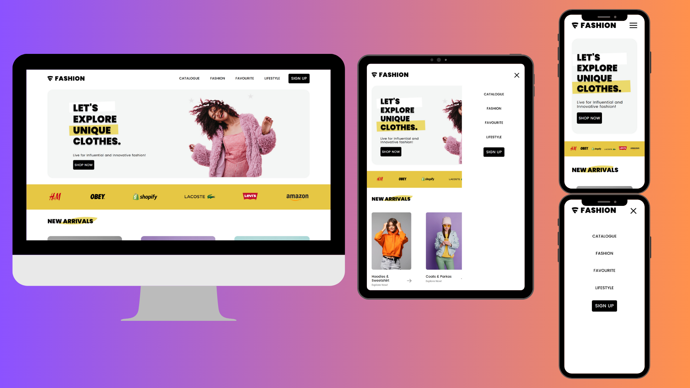
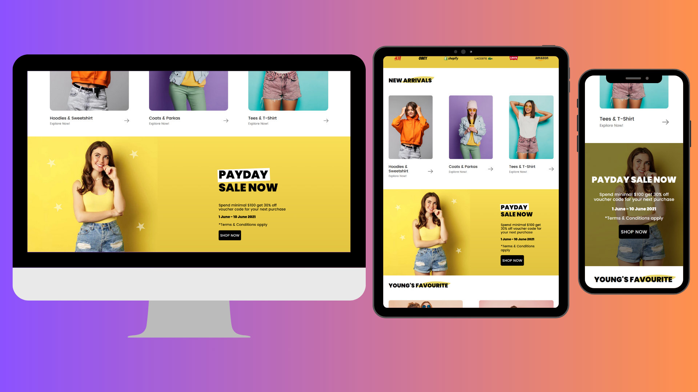
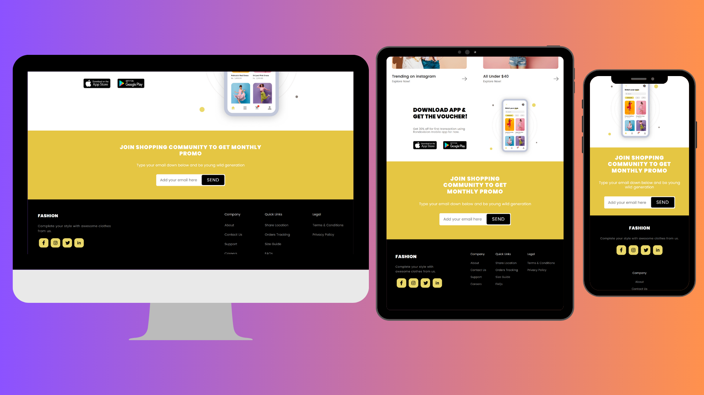

# Fashion E-Commerce 🛍️

Este projeto é uma **landing page responsiva** de uma loja fictícia de roupas, desenvolvido como estudo de **HTML, CSS e JavaScript** durante meu aprendizado em desenvolvimento web. O objetivo foi praticar a construção de interfaces modernas para portfólio, aplicando conceitos de **responsividade**, **semântica** e boas práticas de estilização.

O design foi inspirado em um layout do Figma disponibilizado por **Nickelfox Design**. Algumas melhorias e ajustes foram adicionados ao design original, como efeitos de **hover** nos botões e links, **menu mobile** e **página de login** (frontend apenas).

---

## ✨ Funcionalidades

- Página inicial apresentando catálogo de produtos fictícios
- Página de login (frontend apenas)
- Layout **100% responsivo**, adaptado para diferentes tamanhos de tela
- Estilização fiel ao design original do Figma
- Pequenas interações em **JavaScript** para dinamizar a experiência
- **Hover nos botões e links** e menu adaptado para dispositivos móveis

---

## 🖼️ Demonstração Visual

### Print da Landing Page

  
  
  

---

## 🛠️ Tecnologias utilizadas

- **HTML5**
- **CSS3**
- **Vanilla JavaScript**

---

## 🚀 Como visualizar

👉 [**Demo ao vivo**](https://biarmortari.github.io/fashion-e-commerce/)
